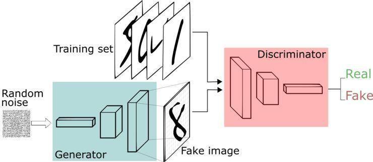

# Vanila-GAN
Teamproject Vanila-GAN Group 2.
Team members: Daniel, Jialu, Lasse

# Documentation<br />
#### 22.05.2020<br />
We got in touch by Email,and the created a whatsapp group and a discord Server.<br />

#### 23.05.2020 - 24.05.2020<br />
We created two channel "code" and "weblinks" on discord,in order to share material.Then we started our first call on discord and discussed how to implement gan.<br />
After reading material for one day,we created the repository "vanila-gan" on github and uploaded the example code.<br />

#### 25.05.2020<br />
Since the structure of the example code is already clear,we divided the tasks before Training-part into four pieces:<br />
  
  - 1.dataset(imlement by Lasse)<br />
  - 2.generator(imlement by Jialu)<br />
  - 3.discriminator(imlement by Daniel)<br />
  - 4.random noise and optimization(random)<br />
  
the first deadline is 31.May.

#### 26.05.2020 - 31.05.2020 <br />
Our own task has been completed while we helped each other to improve the code. <br />

#### 08.06.2020<br />
The second part is to implent Training.

During the third meeting,we :<br />
   - added Random noise ,optimization and Real/fake data target<br />
   - corrected the random noise<br />
   - corrected the generator function<br />
   - corrected the optimization part<br />


#### 13.06.2020 - 17.06.2020<br />
Train-generator and train-discriminator has been added.<br />
We had our fourth meeting and dicussed to improve the logger function and README.<br />


#### ?.06.2020<br />
Mission accomplished.<br />


## Tutorial on how to run the GAN in Colab<br />
1.Open Notebook in Google Colab with following link:https://colab.research.google.com/github/Victorious3/vanila-gan/blob/master/Generative_Adversarial_Networks_PyTorch.ipynb<br />
2.To add this .ipynb file to Drive ,using the link 'https://drive.google.com/drive/my-drive' , run this cell and get authorization code.In this case TensorboardX-2.0 should be installed successfully.<br />
3.In order to run the whole GAN-code,go under 'Run all' over the dropdown menu 'Runtime'.<br />
4.<br />

## Overview<br />
The Vanila GAN is a generative adversarial network that proposed by Ian Goodfellow to use adversarial processes to obtain generative models.The main part consists of Generator and Discriminator.<br />
In this project,we using the MNIST dataset to holding images of handwritten numbers.<br />
Our goal is to let the generator produces a large number of fake images,and let the discriminator to distinguish these 'fake data' and 'training data' .They will improve themselves together in this process,and in the end it will be impossible for discriminator to distinguish fake data and real data.In this way we can get a generator with good enough effect.<br />
The process can be explained with the foto below:<br />


### Specific process <br />
We visualized it with following steps:<br />
1).For the real image x that sampled from the training data, the discriminator D wants the output value of D(x) to be close to 1, which means the training data is judged to be a real picture.<br />
2) Given a random noise z, the discriminator D hopes that the output value of D(G(z)) is close to 0, which means the image generated by the generator G is assumed to be fake; and the generator G hopes that D(G(z) )'s output value is close to 1, which means G wants to cheat D into misjudging the sample generated by generator G as a real image. In this way, G and D constitute the state of the game.<br />
3) During the game, both the generator G and the discriminator D continuously improve their abilities, and finally reach a balanced state. G can generate a image G(z) that is sufficiently mistakable for the real image. For D, it is difficult to determine whether the image generated by G is real or not, so D(G(z)) = 0.5. So our goal is achieved: we get a generative model G, which can be used to generate real pictures.<br />


## Explanation of code<br />
### Setup<br />
We start by mounting a Google Drive

```
from google.colab import drive
drive.mount('/content/drive')

import sys
sys.path.append('/content/drive/My Drive')

!pip3 install tensorboardX
```

import modules that contains the class,methode or variables that we need later

```
import torch
import torch.nn as nn
import torch.optim as optim
from torch.autograd.variable import Variable
import torchvision
from torchvision import transforms
from torchvision.datasets import MNIST
from torchvision.utils import make_grid
from torch.utils.data import DataLoader
import imageio
import numpy
```

import a logger from a separate file but in a same folder as GAN itself.It will be used to log the process of our GAN.

```
from utils import Logger
```

### Dataset<br />
Set batch_size to 5000 since the default parameters will take 5,000 of the training examples. <br />
The MNIST dataset will storage the test change data.

```
MNIST_data = torchvision.datasets.MNIST(
    root='./data/MNIST_data',
    train=True,
    download=True,
    transform=transforms.Compose([
        transforms.ToTensor()
    ])
)
MNIST_loader = torch.utils.data.DataLoader(
    MNIST_data, batch_size=5000
)
```

### Random noise<br />
We need to define some random noise to generate fake images later.<br />
We generate uniform noise from -1 to 1.Since the range of torch.rand is from 0 to 1,we need to plus another one that multiply by -1.

```
def sample_noise(batch_size, dim): 
  n = Variable(torch.rand(batch_size, dim) + torch.rand(batch_size, dim)*(-1))
  if torch.cuda.is_available(): 
    return n.cuda() 
  return n
```

### Discriminator<br />
How discriminator virsualized:


The discriminator is a three hidden-layer discriminative neural network that shown as the structure below:<br />
Fully connected layer<br />
LeakyReLU<br />
Fully connected layer<br />
LeakyReLU<br />
Fully connected layer<br />
The image size is 28 x 28.We define the input features with 28 x 28 = 784 and return if it is real or fake.

```
class DiscriminatorNet(torch.nn.Module):

    def __init__(self):
        super(DiscriminatorNet, self).__init__()
        in_feat = 784
        out_feat = 1

        self.hidden0 = nn.Sequential(
            nn.Linear(in_feat, 1024),
            nn.LeakyReLU(0.2)
        )
        
        self.hidden1 = nn.Sequential(
            nn.Linear(1024, 512),
            nn.LeakyReLU(0.2)
        )

        self.hidden2 = nn.Sequential(
            nn.Linear(512, 256),
            nn.LeakyReLU(0.2),
        )
        self.out = nn.Sequential(
            torch.nn.Linear(256, n_out),
            torch.nn.Sigmoid()
        )

        self.out = nn.Sequential(
            nn.Linear(512, out_feat)
        )

    def forward(self, x):
        x = self.hidden0(x)
        x = self.hidden1(x)
        x = self.out(x)
        return x

```
setup the discriminator
```

    discriminator = DiscriminatorNet()
```

### generator<br />
How generator virsualized:


The generator is also a three hidden-layer neural network that shown as the structure below:<br />
Fully connected layer<br />
ReLU<br />
Fully connected layer<br />
ReLU<br />
Fully connected layer<br />
TanH (to clip the image to be in the range of [-1,1])<br />
The output feature here is also 784,and the input feature is same as dim.
```
class GeneratorNet(torch.nn.Module):

    def __init__(self):
        super(GeneratorNet, self).__init__()
        in_feat = 128
        out_feat = 784

        self.hidden0 = nn.Sequential(
            nn.Linear(in_feat, 256),#do y=Ax+b
            nn.ReLU()
        )

        self.hidden1 = nn.Sequential(
            nn.Linear(256, 512),
            nn.ReLU()
        )

        self.hidden2 = nn.Sequential(
            nn.Linear(512, 1024),
            nn.ReLU()
        )

        self.out = nn.Sequential(
            nn.Linear(1024, out_feat),
            nn.Tanh()
        )        


    def forward(self, x):
        x = self.hidden0(x)
        x = self.hidden1(x)
        x = self.hidden2(x)
        x = self.out(x)
        return x
               
```
setup the generator
```
    generator = GeneratorNet() 
```

### Optimization<br />
We use the Optimizer Adam here.The parameters inside are first the type of network ,lr is learning rate,for example we can reduce the generator's g_loss by changing the initial learning rate of the optimization function.<br />
```
# Optimizers
d_optimizer = optim.Adam(discriminator.parameters(), lr=0.0002)
g_optimizer = optim.Adam(generator.parameters(), lr=0.0002)
```
Define a loss function nn.BCELoss(),input(X,Y),X need to pass Signoid,Y can only be float(0) or float(1).The loss will be calculated during this function. <br />
```
# Loss function
loss = nn.BCELoss()
```
We also define the number of steps to apply to the discriminator and number of epochs (use later in 'for epoch in range')
```
# Number of steps to apply to the discriminator
d_steps = 1
# Number of epochs
num_epochs = 200
```

## Training a GAN
### Real and fake data
Assume the real data are alwalys one and the fake data are always zero, create a tensor containing ones and a tensor containing zeros,shape is equal to size.<br />
One or zero will be returned in case the data is real or fake.

```
def real_data_target(size):

    data = Variable(torch.ones(size, 1))
    if torch.cuda.is_available(): return data.cuda()
    return data

def fake_data_target(size):

    data = Variable(torch.zeros(size, 1))
    if torch.cuda.is_available(): return data.cuda()
    return data
```

### Training Discriminator and Generator
Reset gradients to avoid interference from the last gradient.<br />
The function below will be implemented here.


```
def train_discriminator(optimizer, real_data, fake_data):
    # Reset gradients
    optimizer.zero_grad()

    # Train on Real Data
    real_prediction = discriminator(real_data)

    # Calculate error and backpropagate
    real_error = loss(real_prediction, real_data_target(real_data.size(0)))
    real_error.backward()

    # Train on Fake Data
    fake_prediction = discriminator(fake_data)

    # Calculate error and backpropagate 
    fake_error = loss(fake_prediction, fake_data_target(real_data.size(0)))
    fake_error.backward()

    # Update weights with gradients
    optimizer.step()
    
    # Return error
    return real_error + fake_error, real_prediction, fake_prediction
```

Similar like discriminator 

```
def train_generator(optimizer, fake_data):
    # Reset gradients
    optimizer.zero_grad()
    # Sample noise and generate fake data
    prediction = discriminator(fake_data)
    # Calculate error and backpropagate
    size = prediction.size(0)
    error = loss(prediction, real_data_target(size))
    error.backward()
    # Update weights with gradients
    optimizer.step()
    # Return error
    return error
```

### Testing with logger
In the last step we will running and testing our code.To archived that,we can simply setting the data and using the function we defined before.

```
logger = Logger(model_name='VGAN', data_name='MNIST')
num_batches = 12
num_test_samples = 8

def vectors_to_images(vectors):
    return vectors.view(vectors.size(0), 1, 28, 28)

for epoch in range(num_epochs):
    for n_batch, (real_batch,_) in enumerate(MNIST_loader):

        # Train Discriminator
        real_data = Variable(real_batch.view(real_batch.size(0), 784))
        # if torch.cuda.is_available(): real_data = real_data.cuda()
        # Generate fake data
        fake_data = generator(sample_noise( real_data.size(0), num_batches)).detach()
        # Train D
        d_error, d_pred_real, d_pred_fake = train_discriminator(d_optimizer, real_data, fake_data)

        # Train Generator
        # Generate fake data
        fake_data = generator(sample_noise(real_batch.size(0), num_batches))
        # Train G
        g_error = train_generator(g_optimizer, fake_data)
        # Log error
        logger.log(d_error, g_error, epoch, n_batch, num_batches)
        
        if (n_batch) % 300 == 0: 
            test_images = vectors_to_images(generator(sample_noise(256,256)))
            test_images = test_images.data
            logger.log_images(test_images, num_test_samples,epoch, n_batch, num_batches);
            # Display status Logs
            logger.display_status(epoch, num_epochs, n_batch, num_batches,d_error, g_error, d_pred_real, d_pred_fake)

        # Model Checkpoints
        logger.save_models(generator, discriminator, epoch)
```
